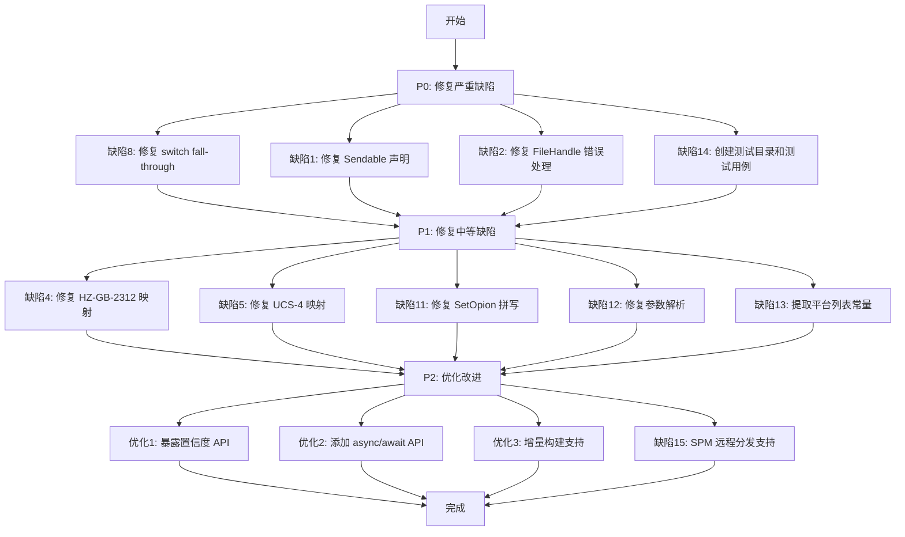

# Uchardet 代码审查与优化计划

## 概述

本文档对 Uchardet 项目（uchardet C 库的 Swift/XCFramework 封装）进行全面代码审查，
涵盖 Swift 封装层、C++ 核心层、构建脚本和 SPM 配置四个维度，
共发现 **16 项缺陷**（4 项严重、9 项中等、3 项优化建议），并给出具体修复方案。

---

## 缺陷优先级说明

| 级别 | 标记 | 含义 |
|------|------|------|
| 严重 | 🔴 | 可能导致崩溃、数据错误或功能完全失效 |
| 中等 | 🟡 | 行为不符合预期、API 语义混乱或潜在隐患 |
| 优化 | 🟢 | 性能、可用性或工程质量改进 |

---

## 第一部分：Swift 封装层（Sources/Uchardet/Uchardet.swift）

### 🔴 缺陷 1：`@unchecked Sendable` 与线程安全注释矛盾

**位置**：`Uchardet.swift` 第 308 行

**问题描述**：
`Uchardet` 类声明了 `@unchecked Sendable`，但注释明确说明"实例本身非线程安全"。
这会让 Swift 并发系统（`async/await`、`actor`）误认为该类型可以安全跨线程传递，
实际上底层 C 句柄 `uchardet_t` 完全不是线程安全的，并发访问会导致崩溃。

**当前代码**：
```swift
public final class Uchardet: @unchecked Sendable {
```

**修复方案 A（推荐）**：移除 `@unchecked Sendable`，让编译器强制要求调用方在 actor 隔离域内使用：
```swift
public final class Uchardet {
```

**修复方案 B**：用 `NSLock` 包装所有操作，使其真正线程安全，然后保留 `@unchecked Sendable`：
```swift
public final class Uchardet: @unchecked Sendable {
    private let handle: uchardet_t
    private let lock = NSLock()

    @discardableResult
    public func handleData(_ data: Data) -> Bool {
        lock.withLock { /* ... */ }
    }
    // 其他方法同理
}
```

---

### 🔴 缺陷 2：`feedFile` 中 `FileHandle` 错误处理不完整

**位置**：`Uchardet.swift` 第 559-587 行

**问题描述**：
1. 新 API `FileHandle.read(upToCount:)` 返回 `Data`（非可选），`guard let` 解包多余且会产生编译警告
2. 旧 API `readData(ofLength:)` 在读取错误时静默返回空 `Data`，无法区分"文件结束"和"读取错误"
3. `defer { fileHandle.closeFile() }` 在新 API 中应使用 `try fileHandle.close()` 以捕获关闭错误

**修复方案**：
```swift
private func feedFile(at url: URL, sampleSize: Int, chunkSize: Int) throws {
    let fileHandle = try FileHandle(forReadingFrom: url)
    defer {
        if #available(macOS 10.15, iOS 13.0, watchOS 6.0, tvOS 13.0, *) {
            try? fileHandle.close()
        } else {
            fileHandle.closeFile()
        }
    }

    let effectiveChunk = max(1, min(chunkSize, sampleSize))
    var totalRead = 0

    while totalRead < sampleSize {
        let remaining = sampleSize - totalRead
        let toRead = min(effectiveChunk, remaining)
        let chunk: Data

        if #available(macOS 10.15.4, iOS 13.4, watchOS 6.2, tvOS 13.4, *) {
            // 新 API 返回非可选 Data，直接使用
            chunk = try fileHandle.read(upToCount: toRead)
        } else {
            chunk = fileHandle.readData(ofLength: toRead)
        }

        guard !chunk.isEmpty else { break }
        totalRead += chunk.count
        let shouldContinue = handleData(chunk)
        if !shouldContinue { break }
    }
}
```

---

### 🟡 缺陷 3：`detect(_ string:)` 语义混乱

**位置**：`Uchardet.swift` 第 410-413 行

**问题描述**：
将 Swift `String`（已知是 Unicode）转为 UTF-8 字节再检测，结果必然是 `"UTF-8"`。
这个 API 没有实际意义，文档注释也没有说明这一限制，容易误导用户。

**修复方案**：在文档注释中明确说明限制，或直接废弃该 API：
```swift
/// - Note: Swift 的 `String` 类型内部使用 Unicode 存储，
///   将其转为 UTF-8 字节后检测结果必然为 `"UTF-8"`。
///   此方法仅用于验证字节序列是否符合 UTF-8 规范。
///   若需检测未知编码的原始字节，请使用 `detect(_ data: Data)` 或 `detect(bytes:)`。
@available(*, deprecated, message: "Swift String 始终为 UTF-8，请使用 detect(_ data: Data)")
public static func detect(_ string: String) -> String? { ... }
```

---

### 🟡 缺陷 4：`HZ-GB-2312` 回退映射不准确

**位置**：`Uchardet.swift` 第 159-162 行

**问题描述**：
HZ-GB-2312 是 7-bit 编码，其转义序列 `~{...~}` 会被 GB18030 解码器误读为乱码。
回退到 GB18030 会导致解码错误，应该返回 `nil` 并在文档中说明不支持。

**当前代码**：
```swift
case "HZ-GB-2312", "HZ", "HZ-GB2312":
    return cf(CFEnc.gb18030)  // 错误：HZ 是 7-bit 编码，GB18030 无法正确解码
```

**修复方案**：
```swift
case "HZ-GB-2312", "HZ", "HZ-GB2312":
    // HZ-GB-2312 是 GB2312 的 7-bit ASCII 安全编码，Apple 平台无原生支持。
    // 不能回退到 GB18030，因为 HZ 的转义序列会被 GB18030 解码器误读。
    // 调用方需要自行处理 HZ 解码（例如先将 HZ 转换为 GB2312 再解码）。
    return nil
```

---

### 🟡 缺陷 5：非标准 UCS-4 字节序映射不精确

**位置**：`Uchardet.swift` 第 127-132 行

**问题描述**：
`X-ISO-10646-UCS-4-34121`（字节序 3-4-1-2）和 `X-ISO-10646-UCS-4-21431`（字节序 2-1-4-3）
是非标准字节序，Apple 平台无法正确解码，但代码返回了"最接近"的编码而不是 `nil`，
会导致解码出乱码而不是明确的失败。

**修复方案**：
```swift
case "X-ISO-10646-UCS-4-34121", "X-ISO-10646-UCS-4-21431":
    // 非标准字节序的 UTF-32 变体，Apple 平台无原生支持，无法正确解码。
    // 返回 nil 让调用方明确知道不支持，而非静默返回错误编码。
    return nil
```

---

### 🟡 缺陷 6：静态方法重复创建实例，高频调用性能差

**位置**：`Uchardet.swift` 第 400-485 行

**问题描述**：
所有静态便捷方法（`detect(_:)`、`detectEncoding(_:)` 等）都各自创建新的 `Uchardet` 实例，
无法利用 `reset()` 复用。对于批量文件检测场景，会产生大量 C 堆内存分配/释放开销。

**修复方案**：提供基于线程局部存储的实例复用：
```swift
// 线程局部存储的检测器实例（每个线程独立，避免竞争）
private static let threadLocalDetector: Uchardet = {
    return Uchardet()
}()

// 或使用 ThreadLocal 包装
private static func withSharedDetector<T>(_ body: (Uchardet) throws -> T) rethrows -> T {
    let detector = Uchardet()  // 简单方案：仍创建新实例，但可扩展为池化
    defer { detector.reset() }
    return try body(detector)
}
```

---

### 🟡 缺陷 7：`sampleSize <= 0` 时行为不明确

**位置**：`Uchardet.swift` 第 563-586 行

**问题描述**：
当 `sampleSize <= 0` 时，`while totalRead < sampleSize` 循环条件立即为假，
直接跳过检测返回 `nil`，调用方无法区分"采样大小为 0"和"检测失败"。

**修复方案**：
```swift
public static func detect(
    contentsOf url: URL,
    sampleSize: Int = 65_536,
    chunkSize: Int = 4_096
) throws -> String? {
    guard sampleSize > 0 else {
        // sampleSize 为 0 或负数时，直接抛出参数错误
        throw CocoaError(.fileReadUnknown,
            userInfo: [NSLocalizedDescriptionKey: "sampleSize 必须大于 0"])
    }
    // ...
}
```

---

### 🟢 优化 1：缺少置信度（confidence）暴露

**问题描述**：
底层 C++ 层计算了置信度（`GetConfidence()`），但 Swift 封装层完全没有暴露。
用户无法知道检测结果的可信程度，只能盲目使用。

**改进方案**：

**步骤 1**：在 `src/uchardet.h` 中增加 C API：
```c
/**
 * Get the confidence of the detected charset (0.0 to 1.0).
 * @param ud [in] handle of an instance of uchardet
 * @return confidence value between 0.0 and 1.0, or -1.0 if not yet detected.
 */
UCHARDET_INTERFACE float uchardet_get_confidence(uchardet_t ud);
```

**步骤 2**：在 `src/uchardet.cpp` 中实现：
```cpp
float uchardet_get_confidence(uchardet_t ud)
{
    return reinterpret_cast<HandleUniversalDetector*>(ud)->GetConfidence();
}
```

**步骤 3**：在 `HandleUniversalDetector` 中添加 `GetConfidence()`：
```cpp
float GetConfidence() const
{
    // 遍历所有 prober，返回最高置信度
    // ...
}
```

**步骤 4**：在 Swift 层暴露：
```swift
/// 获取检测结果的置信度（0.0 ~ 1.0）
/// - Returns: 置信度，尚未检测时返回 `nil`
public var confidence: Float? {
    let c = uchardet_get_confidence(handle)
    return c >= 0 ? c : nil
}
```

---

### 🟢 优化 2：缺少 `async/await` 版本的文件检测 API

**问题描述**：
`detect(contentsOf:)` 使用同步 `FileHandle`，在 Swift 并发环境中会阻塞线程。

**改进方案**：
```swift
@available(macOS 10.15, iOS 13.0, watchOS 6.0, tvOS 13.0, *)
public static func detect(
    contentsOf url: URL,
    sampleSize: Int = 65_536,
    chunkSize: Int = 4_096
) async throws -> String? {
    return try await Task.detached(priority: .utility) {
        try detect(contentsOf: url, sampleSize: sampleSize, chunkSize: chunkSize)
    }.value
}
```

---

## 第二部分：C++ 核心层

### 🔴 缺陷 8：`DataEnd()` 中 `switch` 缺少 `break`，存在 fall-through

**位置**：`src/nsUniversalDetector.cpp` 第 283-299 行

**问题描述**：
`ePureAscii` 和 `eEscAscii` 分支缺少 `break`，会 fall-through 到 `default`。
虽然当前 `default` 只有 `break`，逻辑上无害，但这是潜在的代码质量问题，
未来修改 `default` 分支时会引入 bug。

**当前代码**：
```cpp
case eEscAscii:
case ePureAscii:
    if (mNbspFound) { mDetectedCharset = "ISO-8859-1"; }
    else { mDetectedCharset = "ASCII"; }
default:   // ← 缺少 break，fall-through！
    break;
```

**修复方案**：
```cpp
case eEscAscii:
case ePureAscii:
    if (mNbspFound) {
        mDetectedCharset = "ISO-8859-1";
    } else {
        mDetectedCharset = "ASCII";
    }
    break;  // ← 添加 break
default:
    break;
```

---

### 🟡 缺陷 9：`FilterWith*` 函数的 OOM 返回值被调用方忽略

**位置**：`src/nsCharSetProber.cpp` 第 43-79 行，`src/nsSBCSGroupProber.cpp`

**问题描述**：
`FilterWithoutEnglishLetters` 和 `FilterWithEnglishLetters` 在内存分配失败时返回 `PR_FALSE`，
但调用方（`nsSBCSGroupProber` 等）未检查返回值，内存分配失败会被静默忽略，
导致使用未初始化的 `newBuf` 指针。

**修复方案**：在所有调用点检查返回值：
```cpp
char* newBuf = nullptr;
PRUint32 newLen = 0;
if (!FilterWithoutEnglishLetters(aBuf, aLen, &newBuf, newLen)) {
    return eDetecting;  // 内存不足，跳过本次检测
}
// 使用 newBuf...
PR_FREEIF(newBuf);
```

---

### 🟡 缺陷 10：`Reset()` 中 `strdup("")` 失败时状态不一致

**位置**：`src/uchardet.cpp` 第 68-74 行

**问题描述**：
`strdup("")` 在极端内存压力下可能返回 `NULL`，导致 `m_charset` 为 `NULL`，
与初始化时的状态不一致（初始化时 `m_charset = 0`，`GetCharset()` 返回 `""`，行为一致，
但语义上 `Reset()` 后应该是"空字符串"而非"未初始化"）。

**修复方案**：
```cpp
virtual void Reset()
{
    nsUniversalDetector::Reset();
    if (m_charset) {
        free(m_charset);
        m_charset = nullptr;
    }
    // 不再 strdup("")，GetCharset() 已有 null 检查
}

const char* GetCharset() const
{
    return m_charset ? m_charset : "";
}
```

---

### 🟡 缺陷 11：`nsCharSetProber.h` 中 `SetOpion` 拼写错误且为死代码

**位置**：`src/nsCharSetProber.h` 第 61 行

**问题描述**：
`SetOpion` 是 `SetOption` 的拼写错误，且该纯虚函数在所有子类中均为空实现，
没有任何功能，是死代码。

**修复方案**：
```cpp
// 修复拼写错误，或直接移除该死代码
// 方案 A：修复拼写
virtual void SetOption() = 0;

// 方案 B（推荐）：移除死代码
// 删除该纯虚函数声明及所有子类的空实现
```

---

## 第三部分：构建脚本（build_xcframework.sh）

### 🟡 缺陷 12：命令行参数不支持组合使用

**位置**：`build_xcframework.sh` 第 644-704 行

**问题描述**：
`--output` 和 `--skip` 参数是互斥的 `case` 分支，无法同时使用
（如 `./build_xcframework.sh --output /path --skip watchos` 会报错）。

**修复方案**：改用循环解析参数：
```bash
# 解析所有参数
while [[ $# -gt 0 ]]; do
    case "$1" in
        --help|-h)
            print_help; exit 0 ;;
        --clean)
            do_clean; exit 0 ;;
        --output)
            OUTPUT_DIR="${2:?'--output 需要指定路径'}"
            XCFRAMEWORK_PATH="${OUTPUT_DIR}/uchardet.xcframework"
            shift 2 ;;
        --skip)
            SKIP_PLATFORMS="${2:?'--skip 需要指定平台列表'}"
            shift 2 ;;
        *)
            log_error "未知参数: $1，使用 --help 查看帮助"
            exit 1 ;;
    esac
done
main
```

---

### 🟡 缺陷 13：平台列表硬编码，多处维护不同步

**位置**：`build_xcframework.sh` 第 329-340 行、第 423-434 行

**问题描述**：
`generate_module_support` 和 `assemble_xcframework` 中的 `PLATFORM_IDS` 数组是硬编码的，
与 `main` 中实际构建的平台列表分离维护，未来新增平台时容易遗漏。

**修复方案**：提取为全局变量：
```bash
# 在脚本顶部定义，所有函数共享
ALL_PLATFORM_IDS=(
    "ios"
    "ios_simulator"
    "macos"
    "maccatalyst"
    "tvos"
    "tvos_simulator"
    "watchos"
    "watchos_simulator"
    "visionos"
    "visionos_simulator"
)
```

---

### 🟢 优化 3：缺少增量构建支持

**问题描述**：
每次运行脚本都会完整重建所有平台，没有检测已有构建产物是否仍然有效。

**改进方案**：
```bash
# 检查是否需要重建（源码比构建产物新）
needs_rebuild() {
    local platform="$1"
    local lib="${BUILD_DIR}/${platform}/lib/libuchardet.a"
    [[ ! -f "${lib}" ]] && return 0
    # 如果任何源文件比库文件新，则需要重建
    find "${SOURCE_DIR}/src" -name "*.cpp" -newer "${lib}" | grep -q . && return 0
    return 1
}
```

---

## 第四部分：Package.swift 配置

### 🔴 缺陷 14：测试目标路径不存在，项目无任何测试

**位置**：`Package.swift` 第 35-39 行

**问题描述**：
`Tests/UchardetTests` 目录在项目中不存在，`swift test` 会失败。
整个项目没有任何测试用例，这是严重的质量问题。

**修复方案**：创建测试目录和基础测试文件：

**`Tests/UchardetTests/UchardetTests.swift`**：
```swift
import XCTest
@testable import Uchardet

final class UchardetTests: XCTestCase {

    // MARK: - UTF-8 检测
    func testDetectUTF8() {
        let bytes: [UInt8] = [0xE4, 0xB8, 0xAD, 0xE6, 0x96, 0x87]  // "中文"
        XCTAssertEqual(Uchardet.detect(bytes: bytes), "UTF-8")
    }

    // MARK: - ASCII 检测
    func testDetectASCII() {
        let data = "Hello, World!".data(using: .ascii)!
        XCTAssertEqual(Uchardet.detect(data), "ASCII")
    }

    // MARK: - BOM 检测
    func testDetectUTF16BEBOM() {
        let bom: [UInt8] = [0xFE, 0xFF, 0x00, 0x48]  // UTF-16 BE BOM + 'H'
        XCTAssertEqual(Uchardet.detect(bytes: bom), "UTF-16")
    }

    // MARK: - String.Encoding 映射
    func testEncodingFromCharsetName() {
        XCTAssertEqual(String.Encoding(charsetName: "UTF-8"), .utf8)
        XCTAssertEqual(String.Encoding(charsetName: "utf8"), .utf8)
        XCTAssertEqual(String.Encoding(charsetName: "ASCII"), .ascii)
        XCTAssertNil(String.Encoding(charsetName: ""))
        XCTAssertNil(String.Encoding(charsetName: "INVALID-ENCODING"))
    }

    // MARK: - 增量检测
    func testIncrementalDetection() {
        let detector = Uchardet()
        let bytes: [UInt8] = [0xE4, 0xB8, 0xAD, 0xE6, 0x96, 0x87]
        XCTAssertTrue(detector.handleData(bytes))
        detector.dataEnd()
        XCTAssertEqual(detector.charset, "UTF-8")
        detector.reset()
        XCTAssertNil(detector.charset)
    }

    // MARK: - 空数据
    func testEmptyData() {
        XCTAssertNil(Uchardet.detect(Data()))
        XCTAssertNil(Uchardet.detect(bytes: []))
    }

    // MARK: - fallback 编码
    func testFallbackEncoding() {
        let encoding = Uchardet.detectEncoding(Data(), fallback: .utf8)
        XCTAssertEqual(encoding, .utf8)
    }
}
```

---

### 🟡 缺陷 15：`binaryTarget` 使用本地路径，无法作为远程 SPM 包使用

**位置**：`Package.swift` 第 24-27 行

**问题描述**：
使用本地 `path` 而非 `url` + `checksum`，意味着该包无法通过 GitHub URL 被其他项目依赖。
README 中的 SPM 集成示例实际上无法工作。

**修复方案**：发布时切换为远程 URL：
```swift
// 开发阶段（本地）
.binaryTarget(
    name: "uchardet",
    path: "output/uchardet.xcframework"
),

// 发布阶段（远程，需要先上传 xcframework 的 zip 包并计算 checksum）
// swift package compute-checksum uchardet.xcframework.zip
.binaryTarget(
    name: "uchardet",
    url: "https://github.com/your-org/uchardet/releases/download/1.0.0/uchardet.xcframework.zip",
    checksum: "abc123..."
),
```

同时需要在 `build_xcframework.sh` 中增加打包步骤：
```bash
# 打包 xcframework 为 zip（用于 SPM 远程分发）
zip -r "${OUTPUT_DIR}/uchardet.xcframework.zip" "${XCFRAMEWORK_PATH}"
swift package compute-checksum "${OUTPUT_DIR}/uchardet.xcframework.zip"
```

---

## 改进优先级与实施顺序



---

## 各文件改动汇总

| 文件 | 改动类型 | 涉及缺陷 |
|------|---------|---------|
| `Sources/Uchardet/Uchardet.swift` | 修复 + 优化 | 缺陷 1,2,3,4,5,6,7 + 优化 1,2 |
| `src/uchardet.h` | 新增 API | 优化 1 |
| `src/uchardet.cpp` | 修复 + 新增 | 缺陷 10 + 优化 1 |
| `src/nsUniversalDetector.cpp` | 修复 | 缺陷 8 |
| `src/nsCharSetProber.h` | 修复 | 缺陷 11 |
| `src/nsSBCSGroupProber.cpp` | 修复 | 缺陷 9 |
| `build_xcframework.sh` | 修复 + 优化 | 缺陷 12,13 + 优化 3 |
| `Package.swift` | 修复 | 缺陷 15 |
| `Tests/UchardetTests/UchardetTests.swift` | 新建 | 缺陷 14 |
